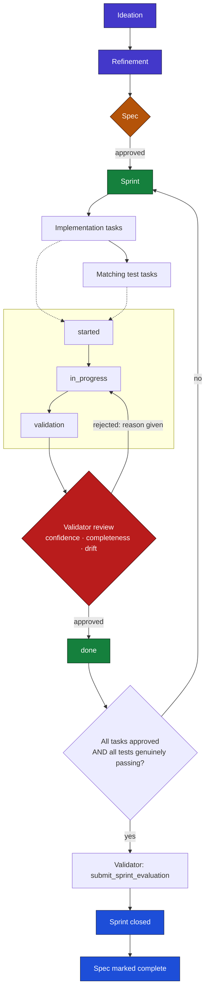

# pulse-brownfield-feature-demo

One spec. Two independent agents. A board that won't let either one mark its own homework done.

A real feature (threaded comment replies with @mention notifications) built on a real existing codebase, governed end-to-end by Okto Pulse.

[About Okto Pulse](#about-okto-pulse) · [The Problem](#the-problem) · [How It Works](#how-it-works) · [Architecture](#architecture) · [Repository Structure](#repository-structure) · [Board & Demo Data](#board--demo-data) · [Roles](#roles) · [Tools Used](#tools-used) · [Prerequisites](#prerequisites) · [Quickstart](#quickstart) · [Running the Target App](#running-the-target-app-app) · [Sprint Stages](#sprint-stages) · [Where to Find Artifacts](#where-to-find-artifacts) · [Contributing & Licensing](#contributing--licensing) · [Conclusion](#conclusion)

## About Okto Pulse

Okto Pulse is a local-first SDLC workbench, running on your own machine with no account required, built for teams using AI coding agents who still want to be able to trace why something was built the way it was, and prove it was actually finished correctly.

In plain terms: instead of an agent going straight from "here's an idea" to "here's the code," Pulse keeps every step explicit and connected:

```
Stories → Ideation → Refinement → Spec → Sprint → Tasks / Tests / Bugs
```

Every one of those stages produces a real, structured record, not just a chat transcript that disappears. Requirements, decisions, and test evidence stay linked to each other, so months later, "why does this work this way" has an actual answer. Agents interact with all of this through MCP; humans can look at the exact same board in a web UI.

## The Problem

AI coding agents are good at producing an implementation. They're not naturally good at proving that implementation actually satisfies what was asked, especially on a codebase that already has its own history and conventions.

Three specific failure modes this repo is built to test directly, not just describe:

- **Status can drift from reality.** A card can be marked "done," a sprint can close, tests can be marked "passed," while the underlying code was never actually written. Nothing about a status label guarantees it's true.
- **Self-review isn't review.** If the same agent that writes a card is also the one that approves it, "approved" just means "the agent still agrees with itself."
- **A rule nobody enforces is a suggestion.** A guideline that only warns doesn't stop bad work from shipping; it just leaves a note next to it on the way out.

Pulse is built with governance gates specifically meant to close these gaps. This repo doesn't take that at face value; it pushes on each one directly, on a real feature, and reports what actually happened.

## How It Works

This repo adds threaded comment replies with @mention notifications to an existing backend API, using two independent AI agents connected to the same Pulse board:

1. **Spec first.** The feature (a self-referencing `parent_comment_id`, a `comment_mentions` table, reply threading, and @mention resolution) is fully specified in Pulse and validated before any implementation task is opened.
2. **Builder implements.** One agent works through each implementation task: reviewing requirements, writing the code, and submitting the task for review with a completeness estimate and any noted deviation from spec.
3. **Validator checks independently.** A separate agent reviews each submission, for confidence, completeness, and drift from spec, and approves or sends it back with a reason. A submission that falls short on any of those three is not approved, regardless of what the builder claims.
4. **Tests are run, not just written.** Test tasks require the scenario to actually execute and pass; automated execution alone isn't accepted as evidence.
5. **The sprint only closes when every task genuinely clears.** All implementation tasks approved, all test scenarios passing, the sprint evaluated and closed, the spec marked complete, in that order, not asserted out of order.

## Architecture

Two agents, Builder (Executor) and Validator, both read and write to the same Pulse board over MCP, with permissions that structurally separate what each is allowed to do. The Builder moves cards through `started → in_progress → validation`; only the Validator can move a card from `validation → done`. Everything either agent does traces back through the same spec → sprint → task lineage.



**Reading the flow**

1. **Ideation → Refinement → Spec**: an idea is refined and turned into a spec before any task exists. A spec must be **approved** before its sprint opens.
2. **Sprint → Tasks**: the sprint's implementation tasks and their matching test tasks are opened once the work they depend on is ready.
3. **Task lifecycle**: every task moves `started → in_progress → validation`. Only the **Builder (Executor)** can drive it this far; the preset structurally blocks the Builder from self-approving.
4. **Validator gate**: every submission is checked independently for confidence, completeness, and drift from spec. Approved tasks move to `done`; anything short on any of the three is sent back to `in_progress` with a reason, not silently passed through.
5. **Sprint close-out**: only once every implementation task is approved *and* every test has genuinely passed (not just executed) does the Validator submit a sprint evaluation and close it. The spec is marked complete only after that.

## Repository Structure

| Path | Purpose |
| ---- | ------- |
| `README.md` | This document |
| `app/` | Forked FastAPI backend under test (`nsidnev/fastapi-realworld-example-app`) |
| `app/FORK_NOTES.md` | Notes on the fork and how it was set up |
| `data/pulse.db` | Bundled SQLite board for the demo (seed data) |
| `docs/decisions/` | Decision records: pre-existing conventions read from the actual code, so both agents build against the same ground truth instead of guessing (e.g. `0001-token-auth-scheme.md`) |
| `docs/walkthrough.md` | Step-by-step guide from clone to closed sprint |
| `docs/prompts/` | The actual prompts for each pipeline stage, in order |
| `docker-compose.yml` | Optional compose for demo services |
| `LICENSE` | Project license |

## Board & Demo Data

| Field | Value |
| ----- | ----- |
| Board name | `pulse-brownfield-feature-demo` |
| Board ID | `af285ee4-9a28-4369-bc9a-ac5ab7c75c7b` |
| Target application | `app/` (fork of `nsidnev/fastapi-realworld-example-app`) |
| Current pipeline checkpoint | Ideation: done (v6), Refinement: done (v4), Spec: approved (v20), Sprints & Cards: N/A |

This snapshot is intended to run the validation gate and exercise the feature in the running app.

## Roles

Okto Pulse enforces role separation through permission presets, not just instructions either agent could ignore. Four presets exist on the platform:

| Preset | Can do | Cannot do |
| ------ | ------ | --------- |
| Spec Writer | Owns ideation, refinement, and spec content | Cannot move a spec past approved |
| Executor (Builder, this repo) | Implements tasks, moves cards through `started → in_progress → validation` | Cannot submit a validation or move a card to done |
| Validator (this repo) | Submits task/spec validation, moves cards `validation → done` | Does not implement |
| QA | Writes test scenarios | Cannot submit any gate |

This repo uses two agent identities specifically: one on the Executor preset (the Builder), one on the Validator preset. Each is a separate connection with its own credentials, not a shared identity switching roles, since that would defeat the separation at the connection level, not just the permission level.

## Tools Used

A sample of the real MCP tools this workflow runs on (Okto Pulse currently exposes 312 core MCP tools over `okto-pulse serve`):

| Tool | Used for |
| ---- | -------- |
| `okto_pulse_get_task_context` | Builder pulls a task's requirements and linked spec context before implementing |
| `okto_pulse_move_card` | Moving a task through its status lifecycle |
| `okto_pulse_submit_task_validation` | Validator submits a confidence/completeness/drift assessment |
| `okto_pulse_get_traceability_report` | Tracing shipped code back through its task, spec, and originating decision |
| `okto_pulse_get_board_guidelines` | Checking what governance rules are actually active on the board |
| `okto_pulse_submit_sprint_evaluation` | Closing out the sprint once every task clears |

## Prerequisites

| Requirement | Notes |
| ----------- | ----- |
| Python 3.11+ | Required by Okto Pulse |
| Two separate agent connections | One Executor, one Validator; do not share credentials between them |
| Docker (optional) | If you prefer containerized Postgres / app runtime |

## Quickstart

Sourced directly from Okto Pulse's own install steps.

1. Install Okto Pulse (CLI & local services):

```bash
pip install okto-pulse
```

2. Initialize a workspace in your project directory:

```bash
okto-pulse init
```

This creates the local data directory (`~/.okto-pulse/`), a default board and agent, and a project-local `.mcp.json` pointing agents at the local MCP server.

3. Seed the demo board (copy bundled DB):

```bash
mkdir -p ~/.okto-pulse/data
cp data/pulse.db ~/.okto-pulse/data/pulse.db
```

4. Start the Okto Pulse workbench (Web UI + MCP server):

```bash
okto-pulse serve
```

| Endpoint | URL |
| -------- | --- |
| Web UI + API | http://localhost:8100 |
| MCP server | http://localhost:8101/mcp |

5. Open the UI at http://localhost:8100, select the `pulse-brownfield-feature-demo` board, and connect two agent identities (Executor and Validator) with separate MCP configs.

From here, follow [`docs/walkthrough.md`](docs/walkthrough.md) for what to do next, stage by stage.

## Running the target app (`app/`)

The `app/` service is a Poetry-managed FastAPI app that runs against PostgreSQL. When running, the backend is available at: http://localhost:8000

1. Install PostgreSQL (15+ recommended). Example macOS (Homebrew):

```bash
brew install postgresql@15
brew services start postgresql@15
```

2. Create the default role and database (example):

```bash
psql postgres -c "CREATE ROLE postgres WITH LOGIN PASSWORD 'postgres' SUPERUSER;"
psql postgres -U postgres -c "CREATE DATABASE rwdb;"
```

3. Install dependencies and start the app:

```bash
cd app
poetry install
cp .env.example .env
poetry run alembic upgrade head
poetry run uvicorn app.main:app --reload
```

See `app/FORK_NOTES.md` for fork-specific setup notes.

## Sprint Stages

This is the actual execution plan this repo's Sprint 1 (Comments Threading + Mentions) runs on: six work items across four sequential stages.

**The six tasks**

| Task | Depends on |
| ---- | ---------- |
| Migration: `parent_comment_id` column + `comment_mentions` table | None (start here) |
| Implement reply threading (create + validation) | Migration |
| Implement @mention parsing/resolution + read paths | Migration |
| Test: Reply threading (create, depth limit, cross-article) | Threading implementation |
| Test: @mentions resolution and listing | Mentions implementation |
| Test: Cascade delete of replies | Threading implementation |

**Builder responsibilities**

For each implementation task: review the task's requirements and any linked material before starting, move it through its stages as work progresses, and on completion submit it for review with a summary of what was built, a completeness estimate, and any deviation from spec.

For each test task: implement and run the assigned scenario(s), and only record a result as passed once it's actually been verified; automated execution alone isn't sufficient.

**Validator responsibilities**

Review every submitted implementation task independently of whoever built it. Assess confidence in the result, completeness against requirements, and drift from spec. Approve, or request changes with a clear reason. A submission that falls short on confidence, completeness, or drift is not approved, regardless of what the builder's own recommendation says.

**Execution order**

Work proceeds in four sequential stages; within a stage, tasks can run in any order or in parallel.

- **Stage 1: Foundation**
  1. Prompt the Builder on the migration task.
  2. Prompt the Validator to review it once submitted.
- **Stage 2: Implementation** (both tasks depend only on the migration; can run in parallel)
  3. Prompt the Builder on reply threading.
  4. Prompt the Builder on @mentions.
  5. Prompt the Validator to review reply threading.
  6. Prompt the Validator to review @mentions.
- **Stage 3: Testing** (each test depends on its matching Stage 2 implementation)
  7. Prompt the Builder on the reply threading test.
  8. Prompt the Builder on the @mentions test.
  9. Prompt the Builder on the cascade delete test.
- **Stage 4: Close-out**
  10. Prompt the Validator to evaluate and close the sprint once every implementation task is approved and every test is passing.
  11. Mark the specification complete.

**Path to completion**

1. All three implementation tasks reviewed and approved.
2. All three test tasks have their scenarios genuinely passing.
3. The sprint is submitted for evaluation and closed on approval.
4. The specification is marked complete only once all sprint work is closed out.

## Where to Find Artifacts

- `data/pulse.db`: SQLite database representing the live walkthrough state used by the demo.
- `docs/walkthrough.md`: what to do after cloning the repo, stage by stage.
- `docs/prompts/`: the actual prompt for each stage, in the order you'll use them.
- `docs/decisions/`: this is a *brownfield* demo, not a greenfield one, so before the spec was written the team read the fork's actual auth and error-handling code and recorded it as a Decision (`0001-token-auth-scheme.md`), rather than assuming the shape from the upstream spec doc. Refinement, Spec, and Validation all check new work against it, so the feature stays consistent with what the codebase already does instead of drifting into a third convention.
- `app/`: FastAPI codebase fork where comments threading and mentions backend extension is implemented. See `app/FORK_NOTES.md` for fork-specific notes.

## Contributing & Licensing

If you want to reproduce the demo or iterate on the sprint: fork this repo, seed your local Okto Pulse data as above, and connect your Builder and Validator agent identities.

This repository is provided under the terms of the included ` ELASTIC LICENSE 2.0` file.

## Conclusion

Built on Okto Pulse, an OktoLabs product. Persistent, structural separation between building and checking, not a prompt both agents have to remember to follow.
